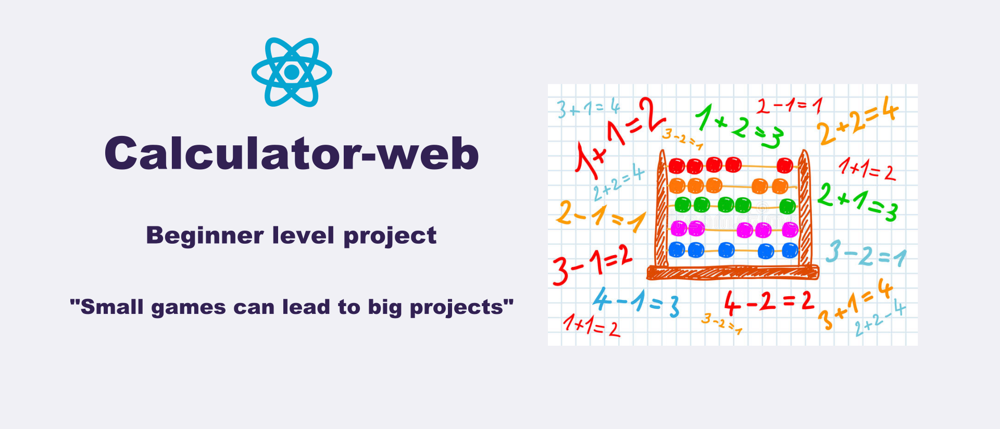
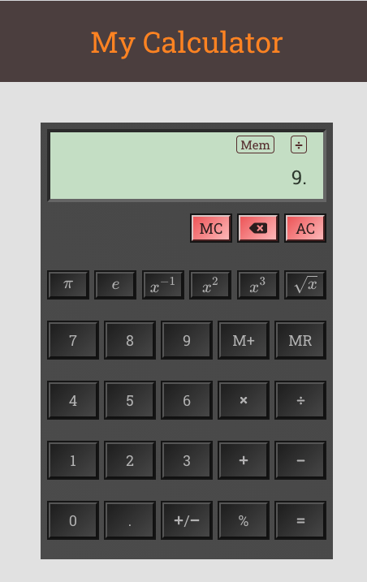

<h1 align="center">
    
</h1>

<p align="center">
  

  

  <a href="https://github.com/orlando-gomes/calculator-web/commits/master">
    
  </a>

   
</p>

<h4 align="center">
	Calculator-web
</h4>

<p align="center">
 <a href="#about">About</a> •
 <a href="#features">Features</a> •
 <a href="#screens">Screens</a> •
 <a href="#how-it-works">How it works</a> •
 <a href="#tech-stack">Tech Stack</a> •
 <a href="#challenge">Challenge</a> •
 <a href="#author">Author</a> •
 <a href="#user-content-license">License</a>

</p>


## About

Calculator-web - is a project created with the objective of composing my portfolio and, why not, as fun.

The project is at a beginner level and aims to test styling and code production capabilities. The only constrain imposed is not using the eval() function to perform the calculations.

---

## Features

- [X] User can see a display showing the current number entered or the result of the last operation.
- [X] User can see an entry pad containing buttons for the digits 0-9, for operations '+', '-', '*' and '/', and '=', and '=' button.
- [X] User can change the sign of the current number on the display, using a '+/-' button.
- [X] User can enter a float number using a '.' button.
- [X] User can calculate the square of a number, the cube, the inverse, the square root and percentages, through specific buttons.
- [X] User can add a specific value in a secondary memory and retrieve it, using the 'M +' and 'MR' buttons.
- [X] User can clear the current memory, the secondary memory and display, digit by digit, through specific buttons.
- [X] The application uses the Mathjax library to display Latex directly in the browser. Latex is widely used to display Math on screen, such as the square root symbol used.
- [X] The application displays some error messages for specific operations, such as square root of negative numbers and division by 0.

---

## Screens

This is a single screen application,

O aplicativo tem tela única, in which work all the above features:
<p align="center">
  
</p>

---

## How it works

This project is divided into three parts:
1. Backend (server folder)
2. Frontend (web folder)
3. Mobile (mobile folder)

Both Frontend and Mobile need the Backend to be running to work.

### Pre-requisites

Before you begin, you will need to have the following tools installed on your machine:
[Git] (https://git-scm.com), [Node.js] (https://nodejs.org/en/).
In addition, it is good to have an editor to work with the code like [VSCode] (https://code.visualstudio.com/)

#### Running the application

```bash

# Clone this repository
$ git clone git@github.com:tgmarinho/README-ecoleta.git

# Access the project folder cmd/terminal
$ cd README-ecoleta

# go to the server folder
$ cd server

# install the dependencies
$ npm install

# Run the application in development mode
$ npm run dev:server

# The server will start on your default browser at port: 3333 - go to http://localhost:3333

```

---

## Tech Stack

The following tools were used in the construction of the project:

#### **Website**  ([React](https://reactjs.org/)  +  [TypeScript](https://www.typescriptlang.org/))

-   **[React MathJax](https://github.com/wko27/react-mathjax)**
-   **[React Formula Beautifier](https://www.npmjs.com/package/react-formula-beautifier)**

> See the file [package.json](https://github.com/orlando-gomes/calculator-web/blob/master/package.json)

---

## Challenge

I didn't find an easy way to deal with the Javascript's difficulty in dealing with precision. For instance:
-  When performing 1.1 * 3, we obtain 3.3000000000000003.

A possible solution might be to perform 11 * 3 and then multiply by (10 ** -1), that is, 10 to the exponent -1. However:
- When performing 33 * (10 ** -1), we obtain the same value 3.3000000000000003.

That is, product of an integer by an exponential can also generate the same error.

A possible solution might be recursively divide by 10, instead of multiplying by exponential. I am still figuring out whether this would be plausible to work it out.

Another problem is differentiate decimals from periodic tithes, where the error is welcome and it's used by most of the implemented calculators.

In addition, the problem also heappens in some additions, not only in multiplications:
-  When performing 0.1 + 0.2, we obtain 0.3000000000000004.

---

## Author

 
 <br />
 <sub><b style="color: #0480ED;">Orlando Gomes</b></sub>
 <br />

[](https://www.linkedin.com/in/orlando-gomes-da-costa-a65a5384/)
[](mailto:orlandosjm@gmail.com)
[](mailto:orlandosjm@yahoo.com.br)

---

## License

This project is under the license [MIT](./LICENSE).

---

##  Versions of README

[Portuguese 🇧🇷 ](./README.md)  | |  [English 🇺🇸](./README-en.md)|
