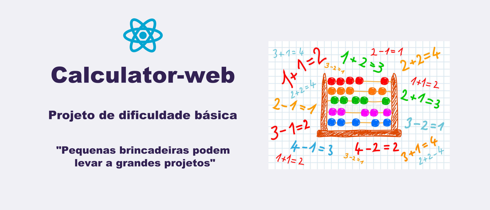

<h1 align="center">
    
</h1>

<p align="center">
  

  

  <a href="https://github.com/orlando-gomes/calculator-web/commits/master">
    
  </a>

   
</p>

<h4 align="center">
	Calculator-web
</h4>

<p align="center">
 <a href="#-sobre-o-projeto">Sobre</a> •
 <a href="#-funcionalidades">Funcionalidades</a> •
 <a href="#-telas">Telas</a> •
 <a href="#-como-executar-o-projeto">Como executar</a> •
 <a href="#-tecnologias">Tecnologias</a> •
 <a href="#-desafio">Desafio</a> •
 <a href="#-autor">Autor</a> •
 <a href="#user-content--licença">Licença</a>
</p>


## Sobre o projeto

Calculator-web - é um projeto criado com objetivo de compor meu portfólio e, por que não, como diversão.

O projeto é de nível iniciante e tem como objetivo testar capacidade de estilização e produção de código. A única restrição imposta é não se poder utilizar a função eval() para executar os cálculos.

---

## Funcionalidades
- [X] O usuário pode ver um display mostrando o número que está sendo digitado no momento ou o resultado da última operação.
- [X] O usuário pode ver um teclado de entrada contendo botões com os dígitos de 0 a 9, com as operações '+', '-', '*' e '/', e o botão '='.
- [X] O usuário pode mudar o sinal do número mostrado no display, através de um botão '+/-'.
- [X] O usuário pode dar entrada em um número decimal, através de um botão '.'.
- [X] O usuário pode calcular o quadrado de um número, o cubo, o inverso, a raiz quadrada e porcentagens, através de botões específicos.
- [X] O usuário pode adicionar um valor específico em uma memória secundária e recuperá-lo, através dos botões 'M+' e 'MR'.
- [X] O usuário pode limpar os valores da memória corrente, da memória secundária e dígito a dígito do display, através de botões específicos.
- [X] O aplicativo usa a biblioteca Mathjax para exibir Latex diretamente no navegador. O Latex é amplamente utilizado para exibir símbolos matemáticos em tela, como o símbolo de raiz quadrada utilizado.
- [X] O aplicativo mostra algumas mensagens de erro para operações específicas, tais como raiz quadrada de números negativos e divisão por 0.

---

## Telas

O aplicativo tem tela única, na qual se desenvolve todas as funcionalidades acima expostas:
<p align="center">
  
</p>


---

## Como executar o projeto

Este projeto é composto apenas de Frontend (execução na web):

### Pré-requisitos

Antes de começar, você vai precisar ter instalado em sua máquina as seguintes ferramentas:
[Git](https://git-scm.com), [Node.js](https://nodejs.org/en/).
Além disto é bom ter um editor para trabalhar com o código como [VSCode](https://code.visualstudio.com/)

#### Rodando a aplicação

```bash

# Clone este repositório
$ git clone https://github.com/orlando-gomes/calculator-web.git

# Acesse a pasta do projeto no seu terminal/cmd
$ cd calculator-web

# Instale as dependências
$ npm install

# Execute a aplicação em modo de desenvolvimento
$ npm run start

# A aplicação será aberta na porta:3000 do seu navegador padrão - acesse http://localhost:3000

```

---

## Tecnologias

As seguintes ferramentas foram usadas na construção do projeto:

#### **Website**  ([React](https://reactjs.org/)  +  [TypeScript](https://www.typescriptlang.org/))

-   **[React MathJax](https://github.com/wko27/react-mathjax)**
-   **[React Formula Beautifier](https://www.npmjs.com/package/react-formula-beautifier)**

> Veja o arquivo  [package.json](https://github.com/orlando-gomes/calculator-web/blob/master/package.json)

---

## Desafio

Não encontrei uma maneira fácil de resolver a dificuldade que o Javascript tem em lidar com a precisão. Por exemplo:
-  Ao calcular 1.1 * 3, obtemos 3.3000000000000003.

Uma solução possível seria calcular 11 * 3 e depois multiplicarmos por (10 ** -1), ou seja, 10 elevado ao expoente -1. Porém:
-  Ao calcular 33 * (10 ** -1), obtemos o mesmo valor 3.3000000000000003.

Ou seja, produto de um inteiro por uma exponencial pode também gerar o mesmo erro.

Uma saída seria dividir recursivamente por 10, em vez de multiplicar por exponencial. Estou ainda estudando se esta seria uma saída plausível.

Outro problema seria diferenciar decimais de dízimas periódicas, onde o erro seria benvindo e utilizado pela maioria das calculadoras implementadas.

Ainda, o erro também aparece em algumas adições, e não somente em multiplicações:
-  Ao calcular 0.1 + 0.2, obtemos 0.3000000000000004.

---

## O Autor

 
 <br />
 <sub><b style="color: #0480ED;">Orlando Gomes</b></sub>
 <br />

[](https://www.linkedin.com/in/orlando-gomes-da-costa-a65a5384/)
[](mailto:orlandosjm@gmail.com)
[](mailto:orlandosjm@yahoo.com.br)

---

## 📝 Licença

Este projeto esta sobe a licença [MIT](./LICENSE).

---

##  Versões do README

[Português 🇧🇷 ](./README.md)  | |  [Inglês 🇺🇸](./README-en.md)|
